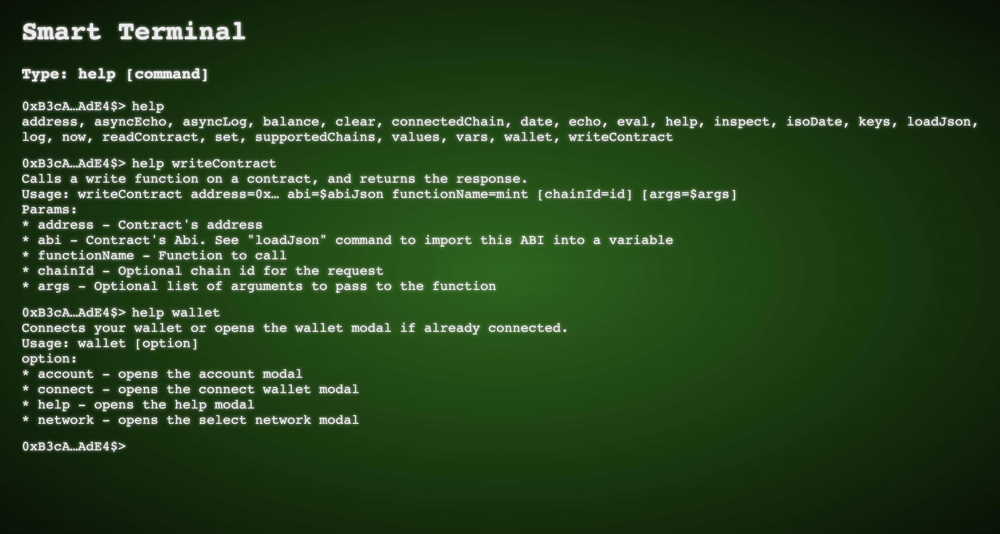

# Smart Terminal (work in progress)

Smart Terminal is a tool to interact with Smart Contracts and make RPC calls from a terminal command line. Even though it's focused on Web3 by wrapping libraries such as [@wagmi/core](https://wagmi.sh/core/getting-started), [Viem](https://viem.sh/) and [Web3Modal](https://web3modal.com/) it can be utilized for other more general purposes by enriching the list of commands.

Latest deployment: https://smart-terminal.vercel.app/

<p align="center">
    
</P>

## List of available commands
### address
Returns the current wallet address.

Usage:
```bash
address
```

Output:
<pre>0xB3cAe61…</pre>

## array
Returns an array with the arguments passed to the command.

Usage:
```bash
array arg1 arg2 arg3 ...
```

Output:
<pre>[arg1, arg2, arg3, ...]</pre>

## asyncEcho
Echos a message asynchronously. Check out [echo](#echo) command for more details.

## asyncLog
Logs a message asynchronously. Check out [log](#log) command for more details.

## author
Shows details about the author of this shell.

Usage:
```bash
author
```

Output:
<pre>
Francisco Ramos &lt;<a href="mailto:jscriptcoder@gmail.com">jscriptcoder@gmail.com</a>&gt;
GitHub: <a href="https://github.com/jscriptcoder" target="_blank">https://github.com/jscriptcoder</a>
LinkedIn: <a href="https://www.linkedin.com/in/jscriptcoder" target="_blank">https://www.linkedin.com/in/jscriptcoder</a>
Medium: <a href="https://medium.com/@jscriptcoder" target="_blank">https://medium.com/@jscriptcoder</a><br>
</pre>


## balance
Returns the balance.

Usage:
```bash
balance [address=0x…] [chainId=id] [formatUnits=units] [token=0x…]
```

Params:
- [address]: Address of balance to get back. Defaults to connected wallet
- [chainId]: Chain id to get the balance from
- [formatUnits]: Units for formatting output. Values: `ether` | `gwei` | `wei`
- [token]: ERC20 contract address

Output
<pre>0.256 ETH</pre>

## balanceDetails
Returns details about balance and token.

Usage:
```bash
balance balanceDetails [address=0x…] [chainId=id] [formatUnits=units] [token=0x…] | inspect
```

Output
<pre>{
  "decimals": 18,
  "formatted": "2",
  "symbol": "BLL",
  "value": 2000000000000000000
}</pre>

## block
Returns information about a block at a block number, hash or tag. Defaults to latest block.

Usage:
```bash
block [blockHash=0x…] [blockNumber=123…] [blockTag=latest] [includeTransactions=false]
```

Params:
- [blockHash]: The hash of the block to retrieve
- [blockNumber]: The block number of the block to retrieve
- [blockTag]: The tag of the block to retrieve. Values: `latest` | `earliest` | `pending` | `safe` | `finalized`
- [includeTransactions]: If true, includes the transactions in the block

## byteArray
Returns an array of bytes with the arguments passed to the command.

Usage:
```bash
byteArray arg1 arg2 arg3 ...
```

Output:
<pre>Uint8Array[arg1, arg2, arg3, ...]</pre>

## clear
Clears the terminal.

## connectedChain
Returns the chain we are currently connected to.

Usage:
```bash
connectedChain | inspect
```

Output:
<pre>{
  "id": 11155111,
  "network": "sepolia",
  "name": "Sepolia",
  "nativeCurrency": {
    "name": "Sepolia Ether",
    "symbol": "SEP",
    "decimals": 18
  },
  rpcUrls: {...},
  blockExplorers: {...},
  ...
}</pre>

## contractEvents
Retrieves events from a contract.

Usage:
```bash
contractEvents abi=$abiJson [chainId=id] [address=0x…] [eventName=Transfer] [fromBlock=0] [toBlock=latest]
```

Params:
- abi: Contract's Abi as JSON. See [loadJson](#loadJson) command to import this file into a variable
- [chainId]: Forces a specific chain id for the request
- [address]: Address of the contract
- [eventName]: Name of the event to filter on
- [fromBlock]: Block number to start the filter from
- [toBlock]: Block number to end the filter at

## date
Returns the current date in a human readable format.

Usage:
```bash
date
```

Output:
<pre>Sat Aug 12 2023 21:41:24 GMT+0200 (Central European Summer Time)</pre>

## echo
Echos a value in the terminal.

Usage:
```bash
echo value
```

Output:
<pre>value</pre>

## editor
Opens an editor to enter data that will be evaluated as Javascript. Pressing `ESC` cancels the operation. `CTRL/CMD+s` closes the editor and returns the result of the evaluation.

Usage:
```bash
editor > result
```

```js
({
  name: 'Fran',
  profession: 'Software Enginner'
})
// CTRL+s
```

Output (in variable `result`):
<pre>{
  "name": "Fran",
  "profession": "Software Enginner"
}</pre>

## encodeAbiParams

## encodePacked

## eval

## findInSerialize

## fromProperty

## getProof

## help
Shows available commands or help about a specific command.

Usage:
```bash
help [command]
```

Params:
- [command]: Command to get help for

## inspect
Helps to visualize objects rather than printing `[object Object]`.

Usage:
```bash
inspect $object
```

Output:
<pre>{
  prop1: value1,
  prop2: [value2, value3, ...],
  prop2: {
    subprop: value4,
    ...
  },
  ...
}</pre>
## isoDate

## keccak256

## keys
Returns the keys of an object as array.

Usage:
```bash
keys $object
```

Output:
<pre>[key1, key2, key3, ...]</pre>

## loadChains

## loadJson

## loadVars

## log

## now

## parseAbiParams

## parseUnits

## property

## readContract

## set

## supportedChains

## switchNetwork

## toBigint

## toBoolean

## toHex

## toNumber

## toRlp

## transactionReceipt

## values
Returns the values of an object as array.

Usage:
```bash
values $object
```

Output:
<pre>[value1, value2, value3, ...]</pre>

## vars
Shows available variables.

Usage:
```bash
vars
```

Output:
<pre>varName1, varName2, varName3, ...</pre>

## wallet

## writeContract


## Developing

Once you've created a project and installed dependencies with `npm install` (or `pnpm install` or `yarn`), start a development server:

```bash
npm run dev

# or start the server and open the app in a new browser tab
npm run dev -- --open
```

## Building

To create a production version of your app:

```bash
npm run build
```

You can preview the production build with `npm run preview`.

> To deploy your app, you may need to install an [adapter](https://kit.svelte.dev/docs/adapters) for your target environment.
