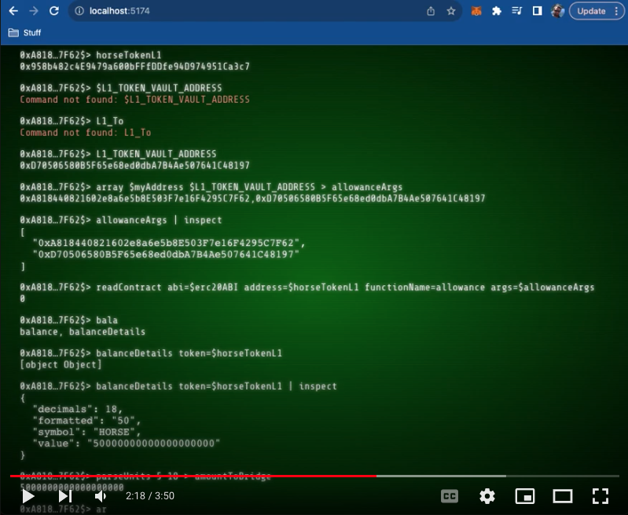
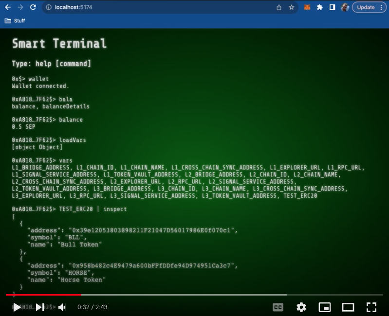

# Smart Terminal (work in progress)

Smart Terminal is a tool to interact with Smart Contracts and make RPC calls from a terminal command line. Even though it's focused on Web3 by wrapping libraries such as [@wagmi/core](https://wagmi.sh/core/getting-started), [Viem](https://viem.sh/) and [Web3Modal](https://web3modal.com/) it can be utilized for other more general purposes by enriching the list of commands.

Latest deployment: https://smart-terminal.vercel.app/

## Examples

### Minting Horse Token
Watch how a mintable ERC20 token is minted into the account.

<a href="https://youtu.be/CalOmrOSg3g" target="_blank">
 
</a>

### Approving Spender Allowance
Watch how we can set an amount as the allowance of spender over the caller's tokens.

<a href="https://youtu.be/KTCe6aTcq9Q" target="_blank">
 
</a>

### Bridging Horse Token
Sending an ERC20 token to the TokenVault contract in order to later on claim it on Taiko chain.

<a href="https://youtu.be/a27E4Rlyy2k" target="_blank">
 
</a>

### Claiming Horse Token
TODO

## List of available commands
### address
Returns the current wallet address.

Usage:
```bash
address
```

Output:
<pre>0xB3cAe61…</pre>

## array
Returns an array with the arguments passed to the command.

Usage:
```bash
array arg1 arg2 arg3 …
```

Output:
<pre>[arg1, arg2, arg3, …]</pre>

## asyncEcho
Echos a message asynchronously. Check out [echo](#echo) command for more details.

## asyncLog
Logs a message asynchronously. Check out [log](#log) command for more details.

## author
Shows details about the author of this shell.

Usage:
```bash
author
```

Output:
<pre>
Francisco Ramos &lt;<a href="mailto:jscriptcoder@gmail.com">jscriptcoder@gmail.com</a>&gt;
GitHub: <a href="https://github.com/jscriptcoder" target="_blank">https://github.com/jscriptcoder</a>
LinkedIn: <a href="https://www.linkedin.com/in/jscriptcoder" target="_blank">https://www.linkedin.com/in/jscriptcoder</a>
Medium: <a href="https://medium.com/@jscriptcoder" target="_blank">https://medium.com/@jscriptcoder</a><br>
</pre>


## balance
Returns the balance.

Usage:
```bash
balance [address=0x…] [chainId=id] [formatUnits=units] [token=0x…]
```

Output
<pre>0.256 ETH</pre>

Params:
- [address]: Address of balance to get back. Defaults to connected wallet
- [chainId]: Chain id to get the balance from
- [formatUnits]: Units for formatting output. Values: `ether` | `gwei` | `wei`
- [token]: ERC20 contract address

## balanceDetails
Returns details about balance and token.

Usage:
```bash
balance balanceDetails [address=0x…] [chainId=id] [formatUnits=units] [token=0x…]
```

Output
<pre>{
  decimals: 18,
  formatted: "2",
  symbol: "BLL",
  value: 2000000000000000000
}</pre>

## block
Returns information about a block at a block number, hash or tag. Defaults to latest block.

Usage:
```bash
block [blockHash=0x…] [blockNumber=123…] [blockTag=latest] [includeTransactions=false]
```

Params:
- [blockHash]: The hash of the block to retrieve
- [blockNumber]: The block number of the block to retrieve
- [blockTag]: The tag of the block to retrieve. Values: `latest` | `earliest` | `pending` | `safe` | `finalized`
- [includeTransactions]: If true, includes the transactions in the block

## byteArray
Returns an array of bytes with the arguments passed to the command.

Usage:
```bash
byteArray arg1 arg2 arg3 …
```

Output:
<pre>Uint8Array[arg1, arg2, arg3, …]</pre>

## clear
Clears the terminal.

## connectedChain
Returns the chain we are currently connected to.

Usage:
```bash
connectedChain
```

Output:
<pre>{
  id: 11155111,
  network: "sepolia",
  name: "Sepolia",
  nativeCurrency: {
    name: "Sepolia Ether",
    symbol: "SEP",
    decimals: 18
  },
  rpcUrls: {…},
  blockExplorers: {…},
  …
}</pre>

## contractEvents
Retrieves events from a contract.

Usage:
```bash
contractEvents abi=$abiJson [chainId=id] [address=0x…] [eventName=Transfer] [fromBlock=0] [toBlock=latest]
```

Output:
<pre>[{
    address: "0x…",
    topics: […],
    data: "0x…",
    blockNumber: 123,
    transactionHash: "0x…",
    transactionIndex: 1,
    blockHash: "0x…",
    …,
    args: {
      msgHash: "0x…",
      message: {…}
    },
    eventName: "MessageSent"
}, …]</pre>

Params:
- abi: Contract's Abi as JSON. See [loadJson](#loadJson) command to import this file into a variable
- [chainId]: Forces a specific chain id for the request
- [address]: Address of the contract
- [eventName]: Name of the event to filter on
- [fromBlock]: Block number to start the filter from
- [toBlock]: Block number to end the filter at

## date
Returns the current date in a human readable format.

Usage:
```bash
date
```

Output:
<pre>Sat Aug 12 2023 21:41:24 GMT+0200 (Central European Summer Time)</pre>

## echo
Echos a value in the terminal.

Usage:
```bash
echo value
```

Output:
<pre>value</pre>

## editor
Opens an editor to enter data that will be evaluated as Javascript. Pressing `ESC` cancels the operation. `CTRL/CMD+s` closes the editor and returns the result of the evaluation.

Usage:
```bash
editor > result
```

```js
({
  name: 'Fran',
  profession: 'Software Enginner',
  timestamp: Date.now(),
})
// CTRL+s
```

Output (in variable `result`):
<pre>{
  name: "Fran",
  profession: "Software Enginner",
  timestamp: 1691869299389
}</pre>

## encodeAbiParams
Generates ABI encoded data using the <a href="https://docs.soliditylang.org/en/latest/abi-spec.html" target="_blank">ABI specification</a>, given a set of ABI parameters (inputs/outputs) and their corresponding values.

Usage:
```bash
encodeAbiParams $abiParams $values
```

Params:
- abiParams: Array of ABI parameters (inputs/outputs). Example: `[{ "name": "amount", "type": "uint256" }]`
- values: Array of values to encode. Example: `[ 123456 ]`

## encodePacked
Generates <a href="https://docs.soliditylang.org/en/v0.8.18/abi-spec.html#non-standard-packed-mode" target="_blank">ABI non-standard packed encoded data</a> given a set of solidity types compatible with packed encoding.

Usage:
```bash
encodePacked $listOfTypes $listOfValues
```

Params:
- listOfTypes: List of solidity types compatible with packed encoding. Example: `['address', 'string', 'bytes16[]']`
- listOfValues: List of values to encode. Example: `['0x123…', 'Hello world', ['0x123…', '0x456…']]`

## eval
Evaluates a JavaScript expression between double quotation.

Usage:
```bash
eval expression
eval "2 + 2" # outputs 4
eval "[1, 2, 3]" # outputs the array
eval "({name: 'Fran', age: 44})" # outputs the object
eval expression > varName # Sends the result to a variable for later use
```

## findInSerialize
Finds objects where the serilized version includes the string passed as parameter.

Usage:
```bash
findInSerialize stringToFind $objects
```

Params:
- stringToFind: String to find in the array of objects
- objects: Array of objects to search in

## formatEther
Converts numerical wei to a string representation of ether.

Usage:
```bash
formatEther 1000000000000000000
```

Output:
<pre>1</pre>

Params:
- value: The wei value

## formatUnits
Divides a number by a given exponent of base 10, and formats it into a string representation of the number.

Usage:
```bash
formatUnits 420000000000 9
```

Output:
<pre>420</pre>

Params:
- value: BigNumber to format as a string, number or bigint
- decimals: Exponent of base 10

## fromProperty
Returns an array with the values of a property in an array of objects.

Usage:
```bash
fromProperty pathToProp $objects
```

Params:
- pathToProp: Path to the property to get. Example: `prop1.prop2.prop3`
- objects: Array of objects to get the property from

## getProof
Returns the account and storage values, including the Merkle proof, of the specified account.

Usage:
```bash
getProof address=0x… storageKeys=["0x…"] block=0x…
```

Output:
<pre>TODO</pre>

Params:
- address: The address of the account for which the balance is to be checked
- storageKeys: An array of storage-keys that should be proofed and included
- block: A hexadecimal block number, or the string `latest` or `earliest`

## help
Shows available commands or help about a specific command.

Usage:
```bash
help [command]
```

Params:
- [command]: Command to get help for

## inspect
Helps to visualize objects rather than printing `[object Object]`.

Usage:
```bash
inspect $object
```

Output:
<pre>{
  "prop1": value1,
  "prop2": [value2, value3, …],
  "prop2": {
    "subprop": value4,
    …
  },
  …
}</pre>
## isoDate
TODO

## keccak256
TODO

## keys
Returns the keys of an object as array.

Usage:
```bash
keys $object
```

Output:
<pre>[key1, key2, key3, …]</pre>

## loadChains
Loads custom chains from a JSON file, sending the parsed json into localStorage and refreshing the app. The new chains will be loaded from the storage and be included in the web3 libs initialzation.

Usage:
```bash
loadChains
```

## loadJson
Loads a JSON file, which can be added into a variable.

Usage:
```bash
loadJson > $parsedJson
```

## loadVars
Loads a JSON file with variables, loading those variables into memory. See (vars)[#vars] command to list available variables.

Usage:
```bash
loadVars
```

## log
TODO

## now
Returns the current date in milliseconds.

Usage:
```bash
now
```

Output:
<pre>1691869299389</pre>

## parseAbiParams
TODO

## parseEther
TODO

## parseUnits
TODO

## property
TODO

## readContract
TODO

## set
TODO

## supportedChains
TODO

## switchNetwork
TODO

## toBigint
TODO

## toBoolean
TODO

## toHex
TODO

## toNumber
TODO

## toRlp
TODO

## transactionReceipt
Waits for a transaction to be mined, and returns the receipt.

Usage:
```bash
transactionReceipt $txHash
```

Output:
<pre>{
  blockHash: "0x…"
  blockNumber: 123…
  contractAddress: "0x…"
  …,
  status: "success",
  to: "0x…",
  transactionHash: "0x…",
  transactionIndex: 1,
  type: "eip1559"
  …
}</pre>

Params:
- txHash: Transaction hash to wait for. Example

## values
Returns the values of an object as array.

Usage:
```bash
values $object
```

Output:
<pre>[value1, value2, value3, …]</pre>

## vars
Shows available variables.

Usage:
```bash
vars
```

Output:
<pre>varName1, varName2, varName3, …</pre>

## wallet
Connects your wallet or opens the wallet modal if already connected.

Usage:
```bash
wallet [option]
```

Params:
- [option] => Option to open a specific modal. Values: `help` | `account` | `connect` | `network`

## writeContract
Calls a write function on a contract and returns the transaction hash.

Usage:
```bash
writeContract address=0x… abi=$abiJson functionName=contractMethod [args=$args]
```

Params:
- address: Address of the contract
- abi: Contract's Abi as JSON. See [loadJson](#loadjson) command to import this file into a variable
- functionName: A function to extract from the ABI and call
- [args]: List of arguments to pass to the function


## Developing

Once you've created a project and installed dependencies with `npm install` (or `pnpm install` or `yarn`), start a development server:

```bash
npm run dev

# or start the server and open the app in a new browser tab
npm run dev -- --open
```

## Building

To create a production version of your app:

```bash
npm run build
```

You can preview the production build with `npm run preview`.

> To deploy your app, you may need to install an [adapter](https://kit.svelte.dev/docs/adapters) for your target environment.
