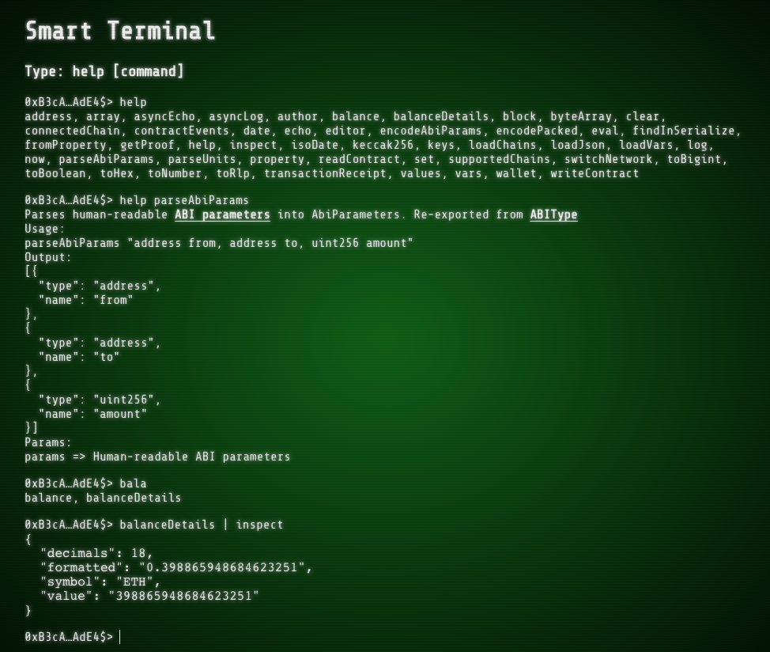

# Smart Terminal (work in progress)

Smart Terminal is a tool to interact with Smart Contracts and make RPC calls from a terminal command line. Even though it's focused on Web3 by wrapping libraries such as [@wagmi/core](https://wagmi.sh/core/getting-started), [Viem](https://viem.sh/) and [Web3Modal](https://web3modal.com/) it can be utilized for other more general purposes by enriching the list of commands.

Latest deployment: https://smart-terminal.vercel.app/

<p align="center">
    
</P>

## List of available commands
### address
Returns the current wallet address.

Usage:
```bash
address
```

Output:
<pre>0xB3cAe61…</pre>

## array
Returns an array with the arguments passed to the command.

Usage:
```bash
array arg1 arg2 arg3 ...
```

Output:
<pre>[arg1, arg2, arg3, ...]</pre>

## asyncEcho
Echos a message asynchronously. Check out [echo](#echo) command for more details.

## asyncLog
Logs a message asynchronously. Check out [log](#log) command for more details.

## author
Shows details about the author of this shell.

Usage:
```bash
author
```

Output:
<pre>
Francisco Ramos &lt;<a href="mailto:jscriptcoder@gmail.com">jscriptcoder@gmail.com</a>&gt;
LinkedIn: <a href="https://www.linkedin.com/in/jscriptcoder" target="_blank">https://www.linkedin.com/in/jscriptcoder</a>
GitHub: <a href="https://github.com/jscriptcoder" target="_blank">https://github.com/jscriptcoder</a>
</pre>


## balance
Returns the balance.

Usage:
```bash
balance [address=0x…] [chainId=id] [formatUnits=units] [token=0x…]
```

Params:
- [address]: Address of balance to get back. Defaults to connected wallet
- [chainId]: Chain id to get the balance from
- [formatUnits]: Units for formatting output. Values: `ether` | `gwei` | `wei`
- [token]: ERC20 contract address

Output
<pre>0.256 ETH</pre>

## balanceDetails
Returns details about balance and token.

Usage:
```bash
balance balanceDetails [address=0x…] [chainId=id] [formatUnits=units] [token=0x…] | inspect
```

Output
<code>
{
  decimals: 18,
  formatted: "2",
  symbol: "BLL",
  value: 2000000000000000000'
}
</code>

## block

## byteArray

## clear

## connectedChain

## contractEvents

## date

## echo

## editor

## encodeAbiParams

## encodePacked

## eval

## findInSerialize

## fromProperty

## getProof

## help

## inspect

## isoDate

## keccak256

## keys

## loadChains

## loadJson

## loadVars

## log

## now

## parseAbiParams

## parseUnits

## property

## readContract

## set

## supportedChains

## switchNetwork

## toBigint

## toBoolean

## toHex

## toNumber

## toRlp

## transactionReceipt

## values

## vars

## wallet

## writeContract


## Developing

Once you've created a project and installed dependencies with `npm install` (or `pnpm install` or `yarn`), start a development server:

```bash
npm run dev

# or start the server and open the app in a new browser tab
npm run dev -- --open
```

## Building

To create a production version of your app:

```bash
npm run build
```

You can preview the production build with `npm run preview`.

> To deploy your app, you may need to install an [adapter](https://kit.svelte.dev/docs/adapters) for your target environment.
